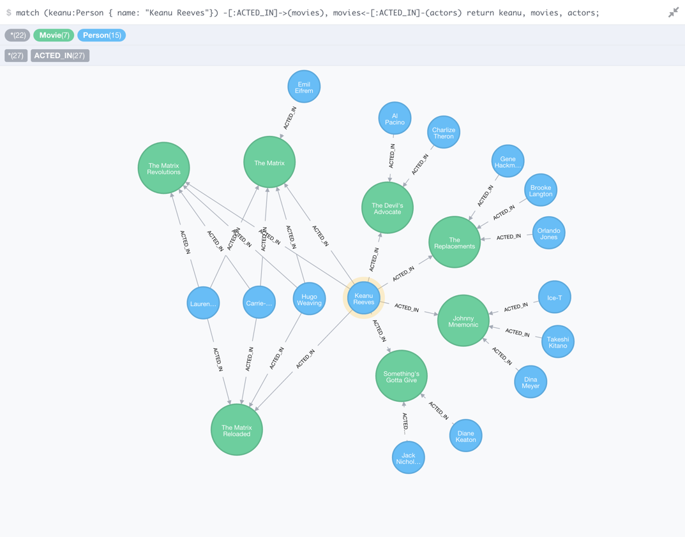
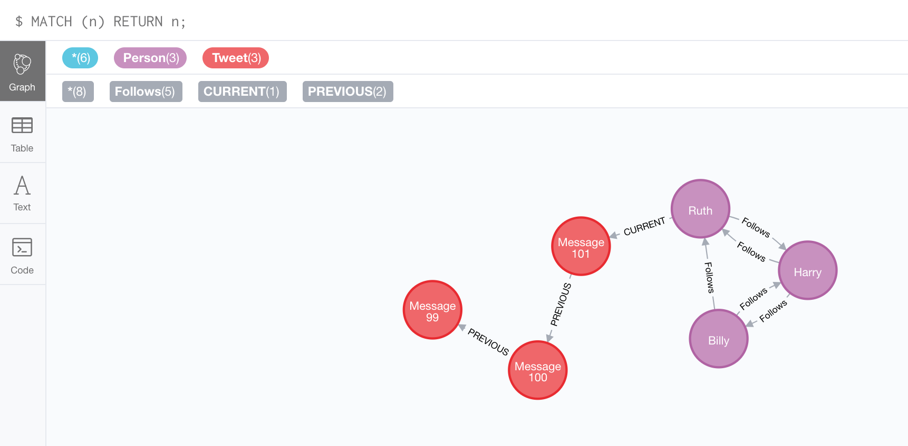

# グラフデータベース
## GraphDBって何ぞや

- グラフを扱うデータベースのこと。  
  - すごい違和感がある表現だけど、実際その通りすぎて何も反論できない。
- "NoSQL"に属するらしい。
- MySQLとかのリレーショナルDBは表構造を扱うDB。

参考:[はじめてのグラフデータベース](https://qiita.com/Amothic/items/55ff226a9e386b6cf3f6)

## グラフって何

- どうもGraphDBにおけるグラフというのは、Yellowfinで言う円グラフとか棒グラフみたいなものを指すわけではないらしい
  - 画像の通り、円と線の集合
- 厳密には、グラフは単なる頂点(vertex)と辺(edge)の集合でしかない
  - 言い換えるなら、一連のノード(接点)とそれらをつなぐ関係(リレーション)の集合ともいえる
- Twitterのデータもグラフで表せる

- 紫と赤は「ノード」
  - 紫がTwitterアカウント
  - 赤はあるアカウントが公開したツイート
- ノードとノードの間にあるのが「リレーション」
  - アカウント同士をつなぐのが"Follows"（ = フォロー）
  - あるアカウントの最新のツイートであることを示すのは"Current"
  - あるツイートの１つ前であることを示すのは"PREVIOUS"
- 画像では、"Ruth"アカウントから"Current"のノードを辿ればすぐに"Ruthの最新のツイート"を見つけられる

-　グラフデータベースはノードとリレーションで表現され、つながりに重きをおいている

## グラフデータベースって何がいいの
- データが膨張しても高いパフォーマンスを発揮する
- 業務を進めてから必要なデータ構造に気づいても、柔軟に変更に対応できる
- テストも簡単に実施できる

参考：[【初心者向け】(随時更新)グラフデータベースについて学んだ事をまとめていく](https://qiita.com/osapiii/items/64982bb84f1ccf389ad2)

## さっきから出てきている画像は何？
- neo4jというグラフデータベースを扱うためのソフトの１つ。
  - 実は今日うめさんがdcd00062にdocker使って導入していた。
- Jenkinsみたいにブラウザ上で動作させられる。
- 公式がユースケース載せてる。詳しくは確認してない。(https://neo4j.com/use-cases/)
- 他社製のグラフデータベースとの互換性を実現するツールopenCypherがある。(http://codezine.jp/article/detail/9046)
- Spring Bootと連携できるらしい。(https://spring.io/guides/gs/accessing-data-neo4j/)
  - 検索アプリケーションを作った事例がある。(https://qiita.com/rubytomato@github/items/c0c7a9cc8121aa4655f0)

参考：[これは、何？](https://qiita.com/e-a-st/items/9e42b59ef33dd48727d8)

## 使いみち
- レコメンド系統で用いられている事例がそこそこある。
- [婚活支援](https://qiita.com/awk256/items/e684fc24fb20f48fd765)
- [グラフデータベースNeo4jを使って、レコメンド機能を実験してみる](https://qiita.com/sussan0416/items/d315b6d1af17a9f0d4f2)

## 気になった書籍
- [RDB技術者のためのNoSQLｶﾞｲﾄﾞ](https://www.amazon.co.jp/dp/B07143JTD9/ref=dp-kindle-redirect?_encoding=UTF8&btkr=1)