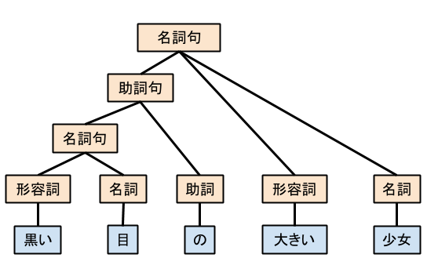

# テキストマイニング
## テキストマイニングって何
大量のテキストデータを自然言語処理(NLP)によって単語やフレーズに分割すること

## 自然言語処理って何
- 人間が日常的に使っている自然言語をコンピュータに処理させる一連の技術
- 人工知能と言語学の一分野
- ←→プログラミング言語
- 自然言語はプログラミング言語と異なり曖昧な部分が多い
  - 例えば「黒い目の大きい少女」
  - 目が黒くて身長が高い少女とも言えるし、目が大きくて身体が黒い少女とも言える
  - この曖昧さを含めてコンピュータにちゃんと理解らせるのが自然言語処理
- 自然言語処理には『機械可読辞書』と『コーパス』が必要
  - 機械可読辞書：コンピュータが語彙を理解するときに必要な辞書のこと（人間用とは違う）
  - コーパス：言語の使用方法を記録・蓄積した文書集合のこと（誰かの著書でも、誰かのツイートでも）
- 昔は容量の制約などで辞書やコーパスに限界があったが、近年の技術進化で実用圏内になった

## テキストマイニングの3つの機能
### 1. 情報の抽出
テキストデータからノイズを除外してマイニングに必要なデータを取り出す、形態素
1. 形態素で分割する
- 形態素とは「言語学の用語で、意味をもつ表現要素の最小単位。 ある言語においてそれ以上分解したら意味をなさなくなるところまで分割して抽出された、音素のまとまりの1つ1つ」
- さっきの例で言うと「黒い」「目」「の」「大きい」「少女」みたいに分ける
- たぶん機械可読辞書を使う

2. 形態素ごとに品詞を付与
- 「黒い」(形容詞) 「目」(名詞) 「の」(助詞) 「大きい」(形容詞) 「少女」(名詞)
- たぶん機械可読辞書を使う

3. 同義語を調べる
- 同義語の辞書を作成・利用することで表記のゆらぎを吸収する
  - 評価が「高い」= 評価が「良い」
  - 値段が「高い」≠ 評価が「良い」

4. 形態素ごとに語形変化を解析
- 近傍に出現する形態素を抽出することで、疑問形や否定形、表現のゆれを抽出する。
  - 「走る」が「走ります」に変わるみたいな

5. 構文解析(係り受け解析)
- 形態素を文節にまとめ、文節間の主述関係や修飾関係を判定する。
- 構文木という表現方法で解析結果を出力する例
  

  

6. 意味解析
- 構造を解析した文章から正しく意味の内容を理解するために解析する
- 4までだと1つの文章に対して2通りの解釈ができてしまうので、求められる解釈を選ぶために解析する
- プログラムを使って自然言語文の意味をコンピュータに教えさせて、求められる方を選ばせる

7. 文脈解析(まだ実用されていない？)
- 他の文章と突き合わせて、文を超えたつながりについて分析する
- 文章中に現れる語の関係や文章の背景に隠れた知識などが必要になるのでむずかしい
- 「太郎はスーパーに行った。そこでお菓子を買った。」の「そこ」＝「スーパー」と理解らせるイメージ

### 2. マイニング
抽出された概念の集合から得たい情報に合わせた新しい情報や知見を得る  
Pentaho使ってる部分みたいなイメージ（実際にPentaho使うかは知らない）

1. 変数間の分析
- 単語の共起性から関連度を計算

2. サンプル間の分析
- テキストデータを似通ったグループにわける。

3. キーワード分析
- キーワードが使われる文脈を分析

4. 多変量解析
- ある対象から得られたお互いに関連のある多種類のデータ（変数、変量）を総合的に要約したり、将来の数値を予測したりといった解析作業の総称
- 分析して将来予測するとかそういうのに近い
- 重回帰分析やクラスター分析など色々な手法がある

### 3. 解析結果の可視化
Yellowfinみたいな可視化  
解析結果の理解や考察の手助けにする